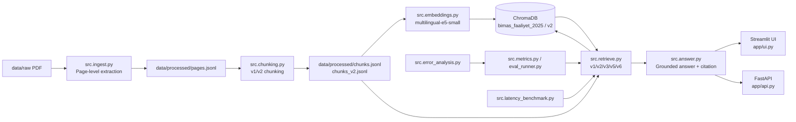
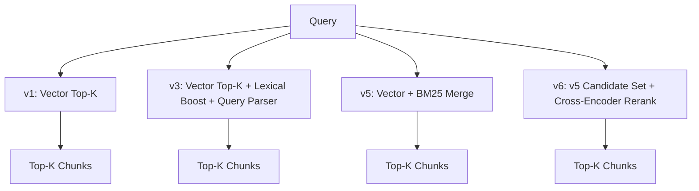

# RAG-Fin Architecture (Week-8)

Bu dokuman, sistemi ise alim/portfolio sunumu icin tek sayfada aciklar.

## A) Sistem Mimarisi

```mermaid
flowchart LR
    A[data/raw PDF] --> B[src.ingest.py<br/>Page-level extraction]
    B --> C[data/processed/pages.jsonl]
    C --> D[src.chunking.py<br/>v1/v2 chunking]
    D --> E[data/processed/chunks.jsonl<br/>chunks_v2.jsonl]
    E --> F[src.embeddings.py<br/>multilingual-e5-small]
    F --> G[(ChromaDB<br/>bimas_faaliyet_2025 / v2)]

    H[src.retrieve.py<br/>v1/v2/v3/v5/v6] --> G
    G --> H
    E --> H

    H --> I[src.answer.py<br/>Grounded answer + citation]
    I --> J[Streamlit UI<br/>app/ui.py]
    I --> K[FastAPI<br/>app/api.py]

    L[src.metrics.py / eval_runner.py] --> H
    M[src.error_analysis.py] --> L
    N[src.latency_benchmark.py] --> H
```

## B) Retrieval Pipeline Karsilastirmasi

```mermaid
flowchart TB
    Q[Query] --> V1[v1: Vector Top-K]
    Q --> V3[v3: Vector Top-K + Lexical Boost + Query Parser]
    Q --> V5[v5: Vector + BM25 Merge]
    Q --> V6[v6: v5 Candidate Set + Cross-Encoder Rerank]

    V1 --> R1[Top-K Chunks]
    V3 --> R3[Top-K Chunks]
    V5 --> R5[Top-K Chunks]
    V6 --> R6[Top-K Chunks]
```

