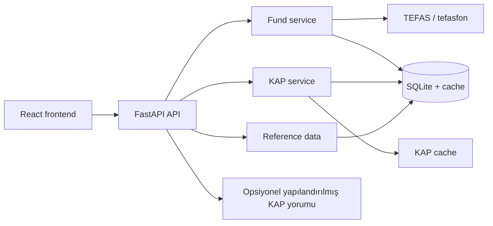

# RAG-FIN mimarisi

Frontend finansal tabloları, KAP bildirimlerini, fon geçmişini ve portföy dağılımını doğrudan yapılandırılmış API sözleşmelerinden render eder. PDF ingest, embedding, ChromaDB ve doğal dil rapor retrieval akışı yoktur.

## Servis sınırları

- `app/api.py`: HTTP sözleşmesi, cache ve market endpoint'leri.
- `app/fund_service.py`: TEFAS fon listesi, geçmişi ve dağılımı.
- `app/kap_service.py` ve `src/kap_fetcher.py`: KAP snapshot, finansallar ve bildirimler.
- `src/nvidia_commentary.py`: yalnızca yapılandırılmış KAP overview payload'ı için isteğe bağlı yorum.
- `app/reference_data.py`: şirket/fon referans evreni ve cache senkronizasyonu.
