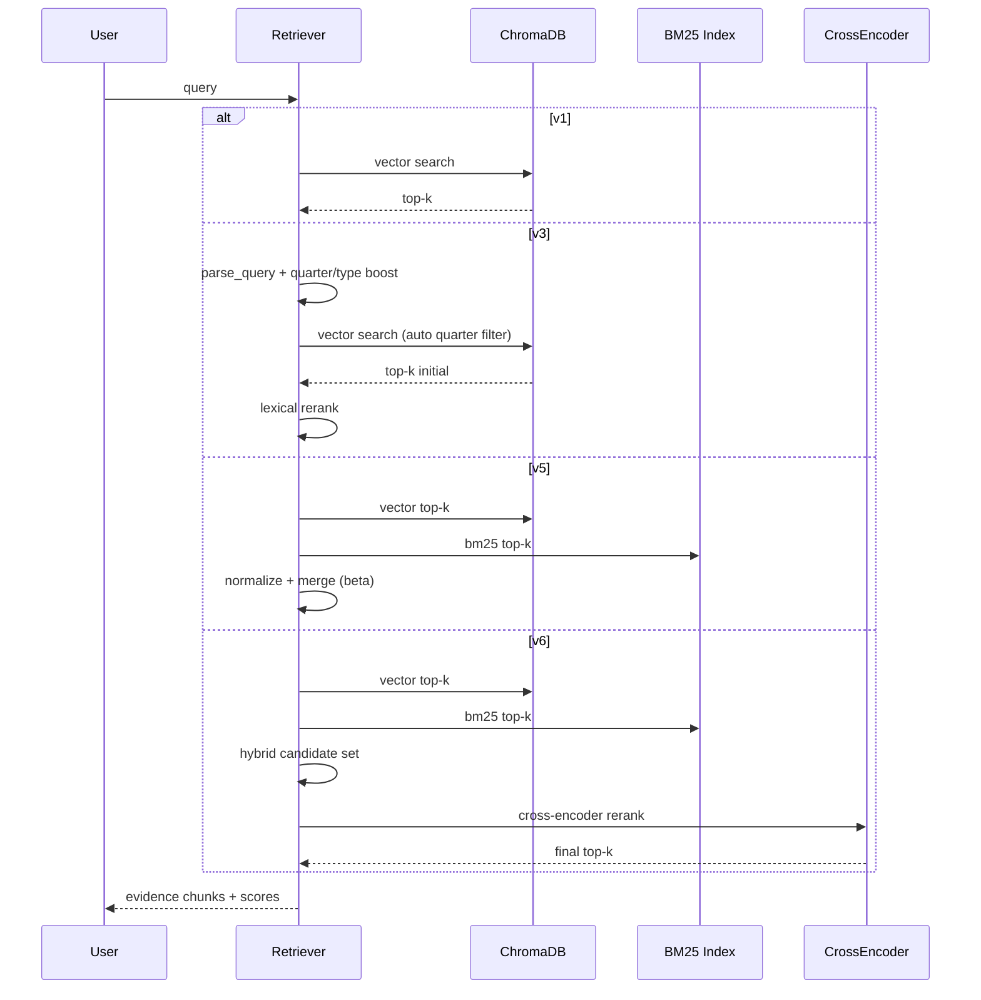
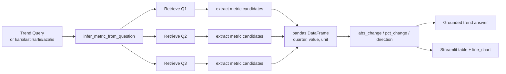

# Retrieval & Trend Flow

## Retrieval Akisi (v1 vs v3 vs v5 vs v6)

```mermaid
sequenceDiagram
    participant U as User
    participant R as Retriever
    participant C as ChromaDB
    participant B as BM25 Index
    participant X as CrossEncoder

    U->>R: query
    alt v1
        R->>C: vector search
        C-->>R: top-k
    else v3
        R->>R: parse_query + quarter/type boost
        R->>C: vector search (auto quarter filter)
        C-->>R: top-k initial
        R->>R: lexical rerank
    else v5
        R->>C: vector top-k
        R->>B: bm25 top-k
        R->>R: normalize + merge (beta)
    else v6
        R->>C: vector top-k
        R->>B: bm25 top-k
        R->>R: hybrid candidate set
        R->>X: cross-encoder rerank
        X-->>R: final top-k
    end
    R-->>U: evidence chunks + scores
```

## C) Week-5 Trend Mode (Q1/Q2/Q3)

```mermaid
flowchart LR
    Q[Trend Query<br/>or karsilastir/artis/azalis] --> P[infer_metric_from_question]
    P --> Q1[Retrieve Q1]
    P --> Q2[Retrieve Q2]
    P --> Q3[Retrieve Q3]

    Q1 --> E1[extract metric candidates]
    Q2 --> E2[extract metric candidates]
    Q3 --> E3[extract metric candidates]

    E1 --> DF[pandas DataFrame<br/>quarter, value, unit]
    E2 --> DF
    E3 --> DF

    DF --> CALC[abs_change / pct_change / direction]
    CALC --> ANS[Grounded trend answer]
    CALC --> UI[Streamlit table + line_chart]
```

